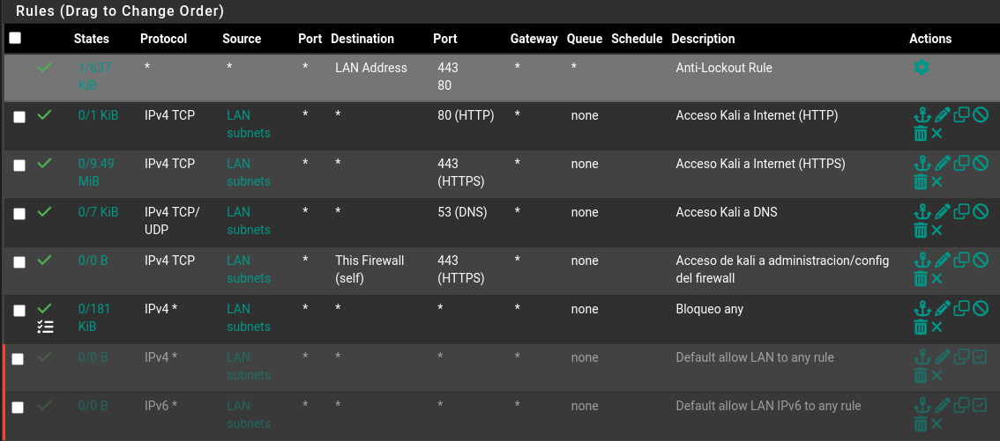

# 01 — Setup pfSense como firewall perimetral

## Objetivo

Levantar pfSense como firewall entre internet y una red interna virtual, replicando una arquitectura básica de un firewall perimetral.

## Arquitectura

```
Internet (WAN)
     │
  em0 Adaptador puente > red real del host
     │
  pfSense 
  em1 Red interna VirtualBox 
     │
  10.0.0.0/24
     │
  Kali Linux 
```

## Configuración de la VM (VirtualBox)

| Parámetro | Configuración |
|---|---|
| OS | FreeBSD |
| RAM | 512 MB |
| Disco | 8 GB (ZFS) |
| Adaptador 1 (WAN) | Adaptador puente Realtek PCIe GbE |
| Adaptador 2 (LAN) | Red interna `lan_pfsense` |

## Instalación

1. ISO descargada desde pfsense.org: AMD64 ISO IPMI/Virtual Machines
2. Instalación con ZFS + GPT sobre disco virtual
3. WAN asignada a `em0` (DHCP), LAN a `em1` (192.168.1.1/24)

## Configuración inicial (Web GUI)

Acceso desde Kali: `http://192.168.1.1`.

| Parámetro | Valor/Nombres |
|---|---|
| Hostname | pfsense-homelab |
| Domain | homelab.lan |
| DNS primario | 8.8.8.8 |
| DNS secundario | 1.1.1.1 |
| Timezone | America/Santiago |
| LAN IP | 10.0.0.1/24 |

## Por qué?

pfSense actúa como un firewall perimetral, separando la red WAN (internet) de la red LAN (interna). Todo el tráfico viaja por pfSense, el cual aplicará reglas del firewall.  

## Hardening reglas de LAN

### ¿El problema? 
Las reglas por defecto de pfSense permiten todo el tráfico desde LAN hacia 
cualquier lado, osea, se está rompiendo la 'regla' del mínimo privilegio en ciberseguridad.

### Política aplicada
Default deny — se bloquea todo y solo se permite lo necesario.

### Reglas creadas (en orden de aplicación)
(Destacar que el orden de estas no importa al ser allows independientes entre ellas)
|Regla|Protocolo|Origen|Destino|Puerto|
|---|---|---|---|---|---|
|Acceso Kali(cliente) a Internet (HTTP)|TCP|LAN subnets|any|80|
|Acceso Kali(cliente) a Internet (HTTPS)|TCP|LAN subnets|any|443|
|Acceso Kali(cliente) a DNS|TCP|LAN subnets|any|53|
|Acceso Kali(cliente) a administración/configuración del firewall(Pfsense)|TCP|LAN subnets|This firewall|443|
|Bloqueo any para bloquear cualquier otra cosa que no sea lo de arriba de esta, que está o se agregue en un futuro|any|LAN subnets|any|any|


### Reglas deshabilitadas
-Default allow LAN to any rule
-Default allow LAN IPv6 to any rule

Como mencionamos anteriormente, estas permiten el acceso de LAN a cualquier destino, totalmente lo contrario a lo que buscamos, asi que por evidencia están deshabilitadas pero lo correcto sería eliminarlas.

### Problema encontrado al momento de probar
WAN y LAN estaban en la misma subred (192.168.1.x), causando que pfSense 
no pudiera entender de forma correcta como funciona el tráfico y enviarlo correctamente a internet.

Algo que se detectó al momento de configurar reglas de firewall y probar conectividades. 

### Solución
- Cambiar LAN de 192.168.1.1/24 a 10.0.0.1/24

### Arquitectura nueva
Internet
    │
Router (192.168.100.x)
    │
pfSense WAN (192.168.100.205)
    │
pfSense LAN (10.0.0.1)
    │
Kali (10.0.0.102)

### Reglas WAN
pfSense aplica implicit deny por defecto en la WAN y entonces, todo tráfico entrante 
no solicitado es bloqueado. Las únicas reglas existentes son bloqueos 
explícitos de redes privadas (RFC 1918) y bogons.
No se requieren reglas adicionales para este homelab sobre la WAN de momento

### Visual de firewall rules (Solo LAN)


## Próximo paso

[2/3] Configurar reglas de firewall, segmentación con VLANs y añadir Suricata como IDS/IPS.