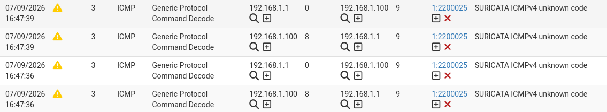
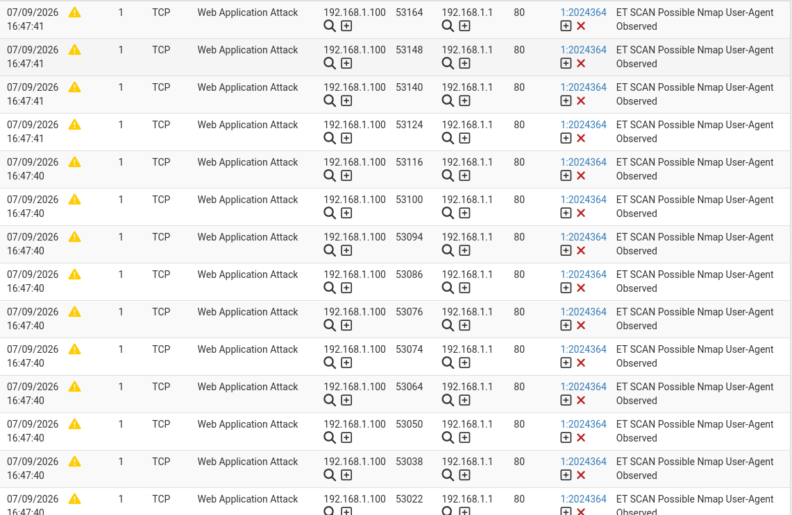
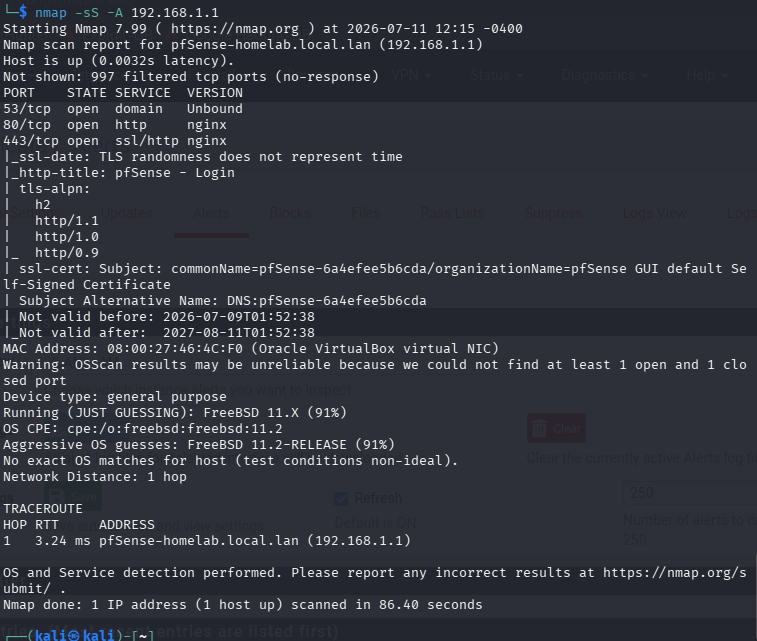
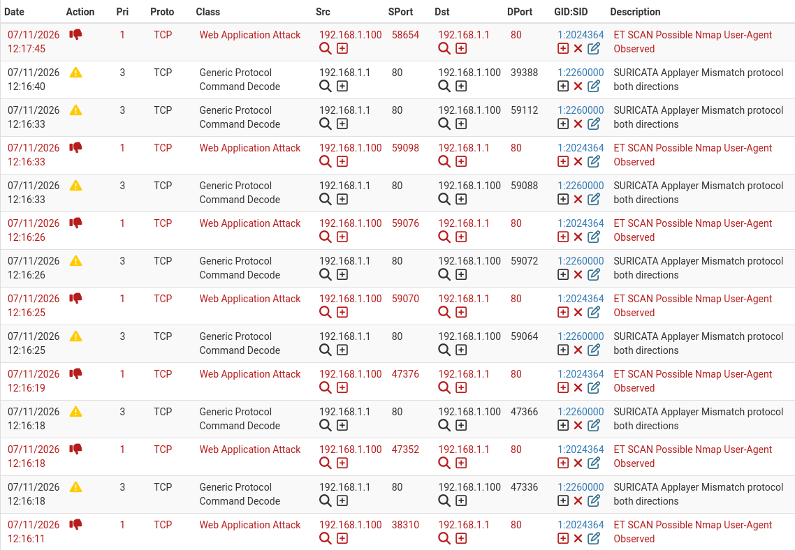

    # 01 — Setup Suricata en el firewall con reglas ETopen

## Objetivo
Activar el IDS de suricata y detectar alertas segun un set de reglas de ETopen, afinar reglas si es que se requiere para falsos positivos detectados por la IDS, para luego aplicar el IPS, bloqueando tráfico que sí lo requiere.

## ¿Que es Suricata?
Es un sistema IDS/IPS, esto significa que detecta y previene intrusos. Este es un paquete adicional para complementar con una inspección más a fondo de paquetes que lo que el firewall trae predeterminado.

## Instalación
Dentro de pfSense 
            
    Sistema
        |
    Package manager
        |
    Available Packages
        |
    Suricata 7.08_5

## Configuración
Primero destacar que debemos remover de System > Advanced > Networking. Las opciones de Hardware TCP Segmentation Offloading y Hardware Large Recieve Offloading (Activados de forma predeterminada). Esto debido a que modifican el paquete previamente y por lo tanto Suricata no lee el paquete completo sino una versión alterada.

En Services > Suricata > Global Settings Instalamos las reglas ETOpen, especificamente ETOPen Emerging Threats rules. Estas reglas son firmas de código que monitorean tráfico, comportamientos malicios y pueden bloquear ataques por lo tanto que son actualizadas frecuentemnete y vienen de forma facíl para su integración en suricata

Luego, en Services > Suricata > Interfaces, añadimos una nueva interfaz, la interfaz a la que Suricata se aplica que es LAN(em1), creamos y en mi caso tuve un problema, no me aparecían las reglas del ETOpen, para esto tuve que actualizarlas, esto fue en Suricata > Updates > Click en el boton de update bajo UPDATE YOUR RULE SET. Luego selecciones las reglas de las que iba a estar definido inicialmente las alertas (Esta interfaz es solo IDS), en LAN Categories emerging-exploit.rules, emerging-malware.rules, emerging-scan.rules en un principio. Estas reglas para empezar y no sobrecargar la VM.

## Prueba
De manera inicial, un comando básico, nmap -sS -A 192.168.1.1 para obtener alertas en nuestro log de Alerts en Suricata. 


-Se pueden observar que las primeras fueron de los paquetes ICMP para el descubrimiento de hosts, que suricata no reconoce.





-También estuvo entremedio de las alertas una de tipo Applayer detect protocol only one direction, esto se debe a que nmap con el -sS, no completa el handshake. Por lo tanto Suricata ve tráfico en 1 sola direccion, no llegando a capturar el protocolo.

## Próximo paso
- [X] Evaluar si emerging-scan detecta SYN scans puros o requiere ajuste de reglas
- [X] Se debe activar Block Offenders para que nuestra IDS pase a modo IPS y podamos realmente bloquear tráfico malicioso

## Observaciones
- nmap -sS solo no generó alertas, requirió -A para ser alertado.
- La alerta fue por el user agent HTTP de nmap, no por el SYN scan
- Como update, no detectaba incluso modificando las reglas por que este solo estaba considerando como origen la external net, el cliente esta en lo que cabería como la home net. Al mismo tiempo la regla que sí detecta el agent de nmap, considera home net como origen

## Activación IPS
Se activó block offender bajo la configuración de la interfaz LAN, en modo inline, debido a que el modo legacy puede llegar a permitir que ciertos paquetes pasen por el firewall antes de hacerles drop.
Block offender es lo que hace el cambio de IDS a IPS, es el cambio que hace que la interfaz según las reglas no actué solo alertando sobre tráfico sino que tome acción y bloquee las conexiones. Está bajo el modo inline, donde existe la excepción que hablaré más adelante la cual es que debemos especificar las reglas que recibiran este drop

Para hacer que las reglas previamente utilizadas de ETOpen en vez de alertar simplemente, hagan drop, se creó un archivo .conf, para hacer una lista drop SID, en esta van dichas reglas de esta forma: 

```conf
dropsid.conf:
ET-scan
ET-exploit
ET-malware
```

Este archivo va en la configuración de listas SID para interfaces, bajo la interfaz LAN, se colocó este archivo como la lista SID a dropear.

Ejecución de Nmap desde el cliente. El estado filtered de los puertos confirma el Drop activo por parte de Suricata, aunque no impide la detección de los puertos ya abiertos por pfSense.


Aquí se puede observar lo que suricata está dropeando del comando nmap


## Observaciones IPS
- Está tambien SURICATA Applayer mismatch protocol both directions, este significa que nmap intenta comunicarse con el protocolo HTTP (Se observa puerto 80 como source port) y los otros son puertos de Kali, Suricata al ver esta comuncación no entiende el protocolo de aplicación en ninguna dirección. En pocas palabras el contenido no cumple con lo que el protocolo dice, HTTP.
- Aún así nmap sigue logrando el scan a pesar de que las conexiones son dropeadas, Esto se debe a que Suricata actúa sobre el contenido de los paquetes, no impide el descubrimiento inicial. Por lo tanto la siguiente iteración será ver reglas del firewall para bloquear el trafico no deseado antes de que llegue a suricata incluso..

## Conclusión de transición IDS a IPS 
La transición de IDS a IPS requiere criterio sobre qué se bloquea. En esta etapa se bloquearon las categorías ET-scan, ET-exploit y ET-malware de ETOpen pero aún falta validar que tráfico legítimo no se vea afectado eso es parte de la siguiente iteración. Debido a que saber que trafico bloquear y cual es lo que diferencia el buen uso del IPS.
Suricata es utíl para bloquear contenido, pero aún así deja una brecha donde los usuarios aún pueden descubrir la red, se debe complementar, pero es un paso más a la seguridad, hay que destacar que IDS permite que los paquetes maliciosos entren y finalmente se topen con el firewall el IPS en cambio es una pared en si misma que destruye el paquete al momento de detectar que un match con las reglas, el paquete no llega al firewall.