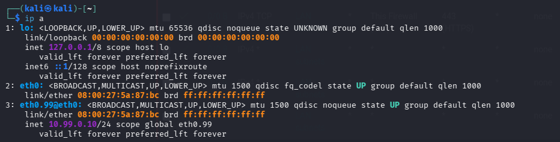
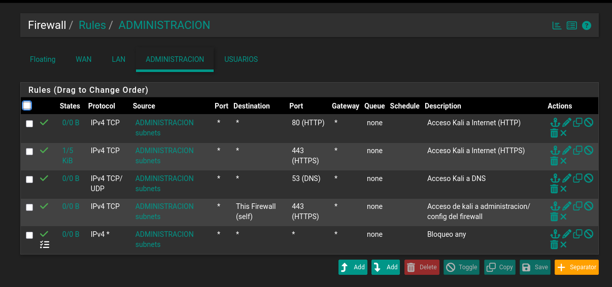
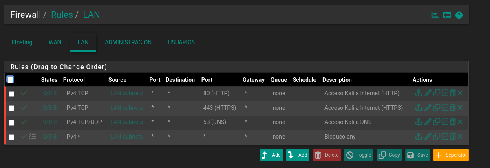
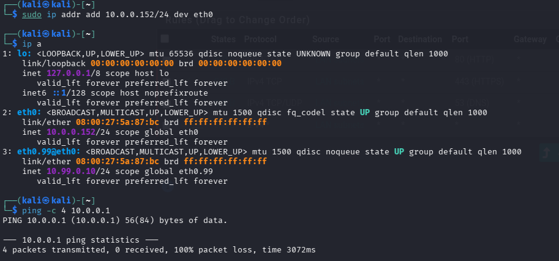

# 04 - Segmentación de VLANS (Router on a stick)

## Objetivo
Implementar una segmentación de red utilizando VLANs (802.1Q) aislando el tráfico de administración del tráfico de usuarios, y asegurar la infraestructura.

## ¿Como sería esto en una red corporativa? Hipervisor vs Hardware
En un entorno corporativo, la segmentación se realiza mediante switches administrables configurando puertos de acceso y trunks. Al virtualizar este laboratorio en VirtualBox, la "Red Interna" actúa como un centro que elimina tráfico etiquetado (tags VLAN).

## ¿Como lo solucionamos?
1. Cambio de Driver: Migración de adaptadores Intel PRO/1000 a `virtio-net` (Red Paravirtualizada) para evitar los problemas donde se elimina el tráfico con tags y mejorar el rendimiento de procesamiento.

2. Modo Promiscuo: Habilitado en la interfaz LAN (Trunk) para forzar al hipervisor a permitir el paso de paquetes etiquetados con 802.1Q hacia las máquinas virtuales, entregandole el enrutamiento a pfSense y la encapsulación a los sistemas operativos como Kali Linux.

## Segmentación

| Interfaz (pfSense) | VLAN Tag | Subred | Propósito | Regla por defecto |
|---|---|---|---|---|
| `vtnet0` (WAN) | N/A | DHCP | Salida a Internet | Implicit Deny |
| `vtnet1` (LAN) | N/A | 10.0.0.0/24 | VLAN nativa / Trunk | Drop All |
| `vtnet1.99` (OPT1) | 99 | 10.99.0.0/24 | Gestión y Administración | Acceso a WebGUI |
| `vtnet1.10` (OPT2) | 10 | 10.10.0.0/24 | Red de Usuarios | Aislada de administración | 

### Evidencia de Configuración
Interfaz de red en Kali Linux inyectando tráfico etiquetado en la VLAN 99:

Reglas de acceso estricto para la red de Administración (Nótese el bloqueo explícito al final):

## Hardening de la VLAN Nativa (Blackhole)
Para la prevención de ataques a traves de VLAN hopping o por si un atacante se conecta directamente al cable trunk: 

- Se deshabilita el servidor DHCP de la interfaz LAN.
- Se eliminó la regla por defecto de 'Default allow LAN to any'
- Se deshabilitó la regla del sistema 'Anti-Lockout', la configuracion/administración pasó a ser solamente de la VLAN 99.

### Evidencia de Auditoría (Blackhole)
Reglas de la interfaz LAN nativa deshabilitadas para prevenir administración no autorizada:

**Resultado del Pentest de validación:** 
Cualquier equipo conectado a la red base sin la configuración 802.1Q específica sufre pérdida de paquetes del 100% y pierde enrutamiento hacia el firewall o internet.
